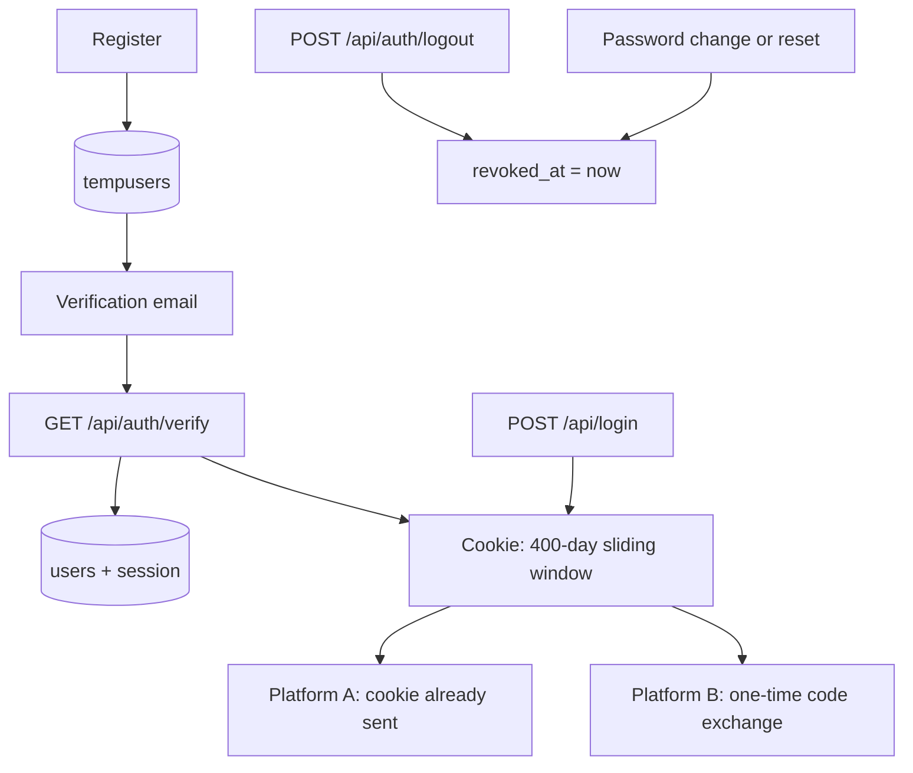

# SilverGate — backend

The brand-wide identity, session and credit service. Flask + Supabase (Postgres
via PostgREST), deployed on Vercel.

This is `ss4/ss3/backend` made Vercel-ready, rebranded to SilverGate, and
re-architected so that **signing in on one platform signs the user in on every
platform, and that session does not expire until they log out.**

Background and rationale: [`../architecture/`](../architecture/) — particularly
`04-authentication.md` and `02-hosting-and-vercel.md`.

---

## The short version of what changed

| Area | Before | Now |
|---|---|---|
| **Credentials** | Three overlapping mechanisms: a Flask signed-cookie session, a 24-hour JWT in `localStorage`, and a JWT passed in a redirect URL | **One** opaque session token in an `HttpOnly` cookie, scoped to the brand domain |
| **Lifetime** | 24 hours, then log in again | Does not expire. Only revocation ends it |
| **Logout** | Cleared the Flask session; the JWT stayed valid everywhere for up to 24h | Revokes the session in the database, everywhere, immediately |
| **Cross-platform** | `?token=<jwt>` in the redirect URL (leaks into history, `Referer`, logs) | Cookie is already present on every `*.brand.com` host; cross-domain platforms get a single-use code |
| **Logging** | `os.mkdir("logs")` + `RotatingFileHandler` → **crashes on serverless** | stdout |
| **Rate limiting** | In-memory (per-instance, so effectively off on serverless) | Configurable shared store |
| **Secrets** | Fell back to `"dev-secret-key-change-in-prod"`, silently, in production | Startup fails if a required secret is missing |
| **Rebrand** | `MetalGate` / `HexStore` throughout | `SilverGate` / `silvergate` |
| **Signup bonus** | `temp_credits_balance` was dropped when a temp user was promoted — the 10 free credits vanished | Carried across |
| **Stripe webhook** | No idempotency despite the README claiming it; a retry could double-grant credits | Claimed by Stripe event id in `stripe_events` |
| **Credits** | One-off packs, raw credit counts shown to users | Monthly plans, no rollover, a usage bar, and an upgrade CTA near the limit |

### Removed as dead code

- `security.py` — an AES-GCM request/response middleware that was imported but never
  applied to a single route. The internal API is protected by `X-Internal-API-Key`.
- `services.py` — `StoreService`, superseded by the live checkout implementation in
  `routes.py`.
- `models.py`, `models-sqlalchemy.py`, `routes_sqlalchemy.py`,
  `routes_sso-sqlalchemy.py`, `services-sqlalchemy.py` — never imported by `app.py`.
- `routes_streamer.py`'s `ADMIN` / `admin123` hardcoded login and its mock data.
- `routes_admin.py`'s `ADMIN_CODE = "FZTH_ADMIN_2024"` source literal and the unused
  `admin_sessions` dict.
- `openai_service.py` — the whole module. It called the completions API, which
  SilverGate never does: platforms log their own AI usage into `ai_usage_logs`.
  `OPENAI_PRICING`, `OPENAI_PROJECT_ID`, `OPENAI_ORGANIZATION_ID` and
  `OPENAI_DEFAULT_MODEL` went with it. `OPENAI_API_KEY` stays, for the admin
  endpoints that read live usage from OpenAI.
- `EmailService.send_welcome_email` / `send_simple_welcome_email` (~480 lines) — the
  caller was dropped when registration moved to a single verification email.
- `sessions.revoke_by_token` / `purge_revoked` — no caller; `revoke_owned` and
  `revoke_all` are what logout uses.
- `platforms.origin_allowed` — superseded by `auth.allowed_origins`.
- The unreachable `from .x import` package-relative branches in `app.py` and
  `routes_admin.py`: `backend/` has no `__init__.py`, so those could never resolve.

`security_enhancements.py` is kept: it is a useful key-generation utility.

### Module layout

Modules are imported **flat** (`import plans`), not as a package: there is no
`__init__.py`, which is what Vercel's `api/index.py` and `gunicorn app:create_app()`
both expect.

| Module | Responsibility |
|---|---|
| `app.py` | Application factory: config validation, logging, CORS, blueprints, error handlers |
| `config.py` | Every environment-driven value, plus `Config.validate()` |
| `db.py` | The single accessor for the Supabase client (`client()` / `require_client()`) |
| `constants.py` | The shared vocabulary — transaction types, token types, statuses, revoke reasons |
| `accounts.py` | `public_user()`, `start_session()`, `perform_login()` — the one sign-in flow |
| `auth.py` | Request credentials: cookie, Bearer, access tokens, origin guard |
| `sessions.py` | Session store, plus the datetime helpers (`now`, `now_iso`, `to_iso`, `parse_dt`) |
| `credits.py` | The two credit buckets, consumption, the `transactions` writer, and the bulk ledger read |
| `plans.py` | Plan registry, usage summary, `allowance_block`, and the upgrade call to action |
| `streamers.py` | The streamer domain: the manager chain, its cycle-safe downline walk, and bulk reads |
| `billing.py` | Stripe: checkout, portal, subscription sync, webhook handling, payouts |
| `email_service.py` | Resend: verification, reset, batch campaign sending, campaign templates |
| `platforms.py` | The configured platform registry (redirect URIs, API keys) |
| `pagination.py` | `fetch_all` / `fetch_in` / `chunked`, which exist because PostgREST caps a response at 1,000 rows and puts every `in.(…)` value in the URL |
| `routes.py` | `/api` — sessions, profile, credits, transactions, billing |
| `routes_sso.py` | `/api` — verification, password reset, the platform SSO exchange |
| `routes_streamer.py` | `/api` — the streamer (partner) portal |
| `routes_admin.py` | `/api/admin` — the admin control platform's data API |

There is no circular import between the route modules: anything they share lives
in `accounts.py`, `credits.py`, `plans.py` or `auth.py`.

---

## Required database migrations

**The service will not authenticate anyone until these are applied.**

```sh
psql "$SUPABASE_DB_URL" -f sql/002_sessions_and_sso.sql
psql "$SUPABASE_DB_URL" -f sql/003_plans_and_subscriptions.sql
psql "$SUPABASE_DB_URL" -f sql/004_admin_audit_and_reset_attempts.sql
```

All three are required and all three are additive and idempotent. `002` creates
`sessions`, `auth_codes` and `login_events` and adds the activity timestamps;
`003` adds `subscriptions`, `stripe_events` and the period usage counter, and is
required for plans; `004` adds `admin_audit_log` and the reset-code attempt
counter.

---

## Plans, usage and the upgrade call to action

Subscriptions replaced one-off credit packs.

| Plan | Price | Monthly allowance |
|---|---|---|
| Lite | €7.99 | 150 credits |
| Pro | €14.99 | 300 credits |
| Ultra | €29.99 | 750 credits |

**Leftover credits do not roll over.** Every paid invoice *overwrites* the balance
with the plan's allowance — it never adds to it. `users.credits_balance` therefore
means "plan credits remaining in the current period".

**Users are no longer shown credit counts.** They see a progress bar, so
`usage.percent` is the headline figure. The raw counts are still in the payload
because the admin platform needs them and because a bar with no underlying data
cannot be debugged — the frontend is expected to render the bar and ignore them.

**Temporary credits fill the bar past full.** Consumption is counted against the
*plan* allowance whichever bucket paid for it, so a user who has spent their
allowance and moved on to temporary credits reads above 100% (`overfilled: true`).
That is the intended signal.

### `GET /api/credits` (alias `/api/plan/usage`)

One payload, used by the dashboard, by `/api/me`, and by platforms through the
SSO. Auth is the session cookie **or** a platform access token, so a connected
platform can call it directly on the signed-in user's behalf.

```json
{
  "plan": {
    "id": "pro", "name": "Pro",
    "credits_per_period": 300, "price_display": "€14.99", "interval": "month",
    "active": true, "status": "active",
    "current_period_end": "2026-10-17T09:00:00+00:00", "cancel_at_period_end": false
  },
  "usage": { "percent": 73.3, "overfilled": false,
             "credits_used": 220, "credits_allowance": 300 },
  "credits": { "plan_remaining": 80, "temporary_remaining": 25,
               "total_remaining": 105, "temporary_next_expiry": "…" },
  "upgrade": {
    "show": true, "reason": "within_threshold", "threshold_percent": 90,
    "next_plan": { "id": "ultra", "name": "Ultra", "credits_per_period": 750 },
    "cta_label": "Upgrade to Ultra to have higher limits",
    "url": "https://fromzerotohero.io/pricing"
  }
}
```

`upgrade` is `null` when it should not be shown. It is present when usage has
reached `SG_UPGRADE_CTA_THRESHOLD_PERCENT` (90 by default — "within 10% of the
limit") **and** a bigger plan exists, and always when the user has no plan. A user
already on Ultra gets `null`: there is nothing to sell them.

Platforms get the same `plan` / `usage` / `upgrade` block inline on
`/api/sso/introspect`, `/api/sso/token`, `/api/sso/verify`, and
`/api/internal/balance`, so rendering the bar and the upsell needs no second call.

## Campaign email sending

Campaigns are sent through Resend's **batch endpoint**: up to 100 recipients per
API call, so a 3,000-recipient campaign is 30 calls rather than 3,000. The
previous per-recipient loop could not finish inside a function timeout — 3,000
sequential API calls is tens of minutes — and it was already failing in
production, where gunicorn's `--timeout 120` would kill the worker part-way
through a large send.

**Recovery is a plain retry.** `POST /api/admin/email-campaign/send` derives an
idempotency key per batch from `campaign_id` plus a fingerprint of that batch's
recipients. If a campaign times out, re-run it with the **same `campaign_id`** and
Resend will not re-send what already went out. The endpoint returns `campaign_id`
so a re-run can reuse it.

The key includes the recipient list deliberately. Keying on the batch index alone
would break the moment the recipient set shifted between attempts — one new signup
is enough — because a different group of 100 would inherit an already-used key and
be silently skipped. Resend's idempotency keys expire after 24 hours, so a retry
after that window is not protected.

**Campaign images must be hosted URLs.** Resend's batch endpoint does not support
attachments, and `_sanitize_image_src` allows `data:image/…;base64` URLs, which
the single-send path converts into inline CID attachments. A campaign carrying an
embedded image would fail or silently lose the image, so the send endpoint
rejects it with a clear message and the preview endpoint returns a non-blocking
`warnings` entry. Verification, reset and welcome emails are unaffected: they are
sent individually and keep their embedded images.

### Pagination

`pagination.fetch_all` pages past PostgREST's **1,000-row per-response cap**.
Without it a bulk read silently truncates, which is how a campaign aimed at 3,000
people would email 1,000 with nothing in the response to say so.

Applied so far to the campaign recipient queries only — those were the ones that
directly broke a feature. **The rest of the admin API still reads unpaginated**, so
`GET /api/admin/users`, several analytics counters and the streamer lists remain
capped at 1,000 rows. That is the next thing to fix before the admin platform is
trusted; it needs an `order(...)` on each query as well, since Postgres is free to
reorder between pages and rows can otherwise be skipped or repeated.

### Transaction types

`transactions.type` distinguishes credit-in from credit-out, and which kind of
grant it was. Analytics code must match all credit-in types — filtering on
`purchase` alone reports zero for every subscriber, since one-off packs are retired.

| `type` | Written by | Meaning |
|---|---|---|
| `subscription_grant` | `billing.grant_period_allowance` | A plan allowance for a new billing period |
| `purchase` | *legacy* | One-off credit packs, before subscriptions |
| `bonus` | temporary credit grants (referral, signup, admin, `/internal/add`) | A granted expiring credit |
| `deduction` | `/internal/deduct`, `/user/deduct` | Credits spent by a platform |

`GET /api/transactions` returns `type` alongside the existing fields.

## How a user stays signed in



- The cookie is `HttpOnly`, `Secure`, `SameSite=Lax`, `Domain=.brand.com`, with a
  400-day `Max-Age` **re-issued on activity**. 400 days is Chrome's hard cap, so the
  re-issue is what makes it effectively permanent for an active user.
- The token is stored only as a SHA-256 hash. A database dump yields nothing usable.
- Because the cookie is on the parent domain, **every** `*.brand.com` host receives it.
- Platforms that cannot share the cookie (`*.vercel.app`, partner sites) use
  `/api/sso/authorize` → one-time code → `/api/sso/token`.

Set `SG_SESSION_COOKIE_DOMAIN` or none of this works — see `.env.example`.

---

## Endpoints

### Session lifecycle

| Method | Path | Notes |
|---|---|---|
| POST | `/api/register` | Writes `tempusers`, emails a link. No session yet |
| GET | `/api/auth/verify?token=` | Promotes the user **and creates the session**, then redirects |
| POST | `/api/sso/verify-email` | Same, for a frontend that posts the token itself |
| POST | `/api/login`, `/api/auth/login` | Password → session cookie + short-lived access token |
| POST | `/api/sso/login` | Alias of `/api/login` |
| GET | `/api/session`, `/api/auth/session` | `200` + user, or `401`. **Call this first on every page** |
| POST | `/api/auth/logout` | Revoke this session |
| POST | `/api/auth/logout-all` | Revoke every session |
| GET | `/api/auth/sessions` | Device list |
| DELETE | `/api/auth/sessions/<id>` | Sign one device out |
| POST | `/api/auth/change-password` | Revokes all other sessions |
| POST | `/api/sso/forgot-password` · `/verify-reset-code` · `/reset-password` | Reset revokes all sessions |

### Plans and billing

| Method | Path | Notes |
|---|---|---|
| GET | `/api/plans` | Available monthly plans, cheapest first. Public |
| GET | `/api/credits` · `/api/credits/` · `/api/plan/usage` | The usage bar, plan and upgrade CTA |
| POST | `/api/stripe/subscribe` | `{"plan_id": "pro"}` → Checkout URL for a monthly subscription |
| POST | `/api/stripe/portal` | Stripe's hosted portal: change plan, card, cancel |
| POST | `/api/stripe/webhook` | Stripe events (idempotent) |
| GET/POST | `/api/stripe/packs`, `/api/stripe/create-checkout-session` | **Retired.** Returns `410` with a pointer to the replacements |

### Streamers (partners)

| Method | Path | Notes |
|---|---|---|
| POST | `/api/streamer/login` | `id_code` + password → bearer token |
| GET | `/api/streamer/profile` · `/dashboard` | Own profile and balance |
| GET | `/api/streamer/subordinates` | Direct subordinates, paged |
| GET | `/api/streamer/<id>/subscribed` | The caller's **whole branch**: their own referred users plus their downline's. Paged |

### Admin

Gated by `X-Admin-Code`. Every bulk read is chunked and paged.

| Method | Path | Notes |
|---|---|---|
| GET | `/api/admin/stats` · `/users` · `/users/<id>` · `/transactions` · `/activity` | Customer analytics |
| GET | `/api/admin/streamers` | Paged list, with `subordinate_ids` and `network_referred_num` per manager |
| GET | `/api/admin/streamers/<id>` | One streamer's **branch**: subordinate streamers and every user they collectively referred, each paged |
| POST | `/api/admin/streamers` · PATCH `/streamers/<id>/manager` | Create a partner; assign or clear a manager (cycle-checked) |
| POST | `/api/admin/users/<id>/credits` | Grant temporary credits |
| POST | `/api/admin/email-campaign/preview` · `/send` | Filtered campaigns, batched through Resend |
| GET | `/api/admin/ai/*` · `/openai/*` | AI usage from `ai_usage_logs`, plus a live read from OpenAI |

### Platform integration

| Method | Path | Auth |
|---|---|---|
| GET | `/api/sso/authorize` | Session cookie; redirects with a one-time code |
| POST | `/api/sso/token` | `X-Platform-Key` or PKCE |
| POST | `/api/sso/introspect` | `X-Platform-Key` or `X-Internal-API-Key` |

### Unchanged, kept working

`/api/me` (GET/PUT/DELETE), `/api/profile`, `/api/transactions`, `/api/stats/users`,
`/api/sso/verify`, `/api/sso/verify-token`, `/api/sso/user-info`,
`/api/sso/send-verification`, `/api/streamer/*`, `/api/admin/*`, `/health`.

The credit endpoints remain at **both** their old paths (`/api/internal/add`,
`/api/user/add`, and the matching `balance`/`deduct` pairs) so existing callers are
unaffected; they now share one implementation instead of four copies.

### Behaviour changes to be aware of

- **One-off credit packs are gone.** `/api/stripe/packs` and
  `/api/stripe/create-checkout-session` return `410` and point at `/api/plans` and
  `/api/stripe/subscribe`. Anything still calling them needs updating.
- **`users.credits_balance` changed meaning** from "purchased credits" to "plan
  credits remaining this period". Existing balances are preserved and simply show
  as "no plan" until the user subscribes.
- **Temporary credits are the only way to grant bonus credits now.** With no
  permanent non-plan bucket, a referral bonus granted as a temp credit expires
  where it previously did not. Worth a product decision — see below.
- **`process_referral_purchase` is no longer called.** Subscription revenue is paid
  out by `billing.payout_streamers`, which mirrors its percentages, walks the
  manager chain, and keeps the loop-guard the SQL function lacked.

- `/api/login` now **also** returns `token` (a short-lived access token). Additive.
- Old 24-hour `metalgate_token` JWTs are **not accepted**. Every signed-in user logs in
  once more after cutover, then never again. Passwords are unaffected —
  `auth_utils.verify_password` still upgrades legacy SHA-256 hashes on login.
- Passwords now require **8** characters (was 6 on reset, unbounded on register).
- `POST /api/auth/login` from a browser whose `Origin` is not in `SG_CORS_ORIGINS`
  returns 403 when a session cookie is present. Add every frontend origin.
- `POST /api/internal/add` (and `/api/user/add`) now accept `expires_at` (ISO-8601) or
  `expires_in_days`, so the granter chooses when temporary credits lapse. Omitting both
  uses `SG_TEMP_GRANT_TTL_DAYS` — the same configurable default every other grant path
  applies. `amount` is now validated: a non-integral value is rejected instead of being
  silently truncated.
- **`POST /api/sso/send-verification` always returns `200`** with one neutral message,
  for a pending address, an already-verified one and an unknown one alike. Returning
  `404` for an unknown address made it a scriptable "is this email registered?" oracle;
  this now matches `forgot-password`. The trade-off is that an already-verified user is
  no longer told so by this endpoint — the login form tells them instead.
- **The Stripe return URLs are built from configuration, not from the caller's
  `Origin`**, and they point at the frontend's account page
  (`SG_DASHBOARD_URL` + `?subscription=success|cancel`). They used to be
  `{Origin}/dashboard.html?subscription=…` — a path from the previous static
  frontend that does not exist in the Next.js one, so a paying customer was
  redirected to a 404. Override with `SG_CHECKOUT_SUCCESS_URL` / `SG_CHECKOUT_CANCEL_URL`.
- **`SG_DASHBOARD_URL` now defaults to `{APP_URL}/account`** instead of
  `/dashboard`, matching the frontend's real workspace page. It is only a fallback
  — used after verification when the link carried no `redirect`, and when returning
  from the Stripe portal. The frontend also serves `/dashboard` as a redirect to
  `/account`, so either value works in an existing environment.
- **The verification email links to the frontend page**, which posts the token to
  `/api/sso/verify-email` and receives the cookie. `SG_EMAIL_VERIFY_VIA_API` stays
  `false`; setting it `true` points the link straight at the API instead, as a
  fallback for when the frontend is unavailable. `SG_EMAIL_VERIFY_VIA_API=true` in
  `.env.example` was wrong and is now `false`.
- **Admin responses no longer carry `"success": true`.** They return `{"message": …}`
  plus their payload, or `{"error": …}`, like the rest of the API. Nothing about the
  data changed; only the envelope.
- **The streamer portal and the admin API now report the whole branch.** A manager
  (a streamer with others beneath them) sees the users referred by every streamer in
  their downline, not just their own, and each user carries the `streamer_code` that
  owns them. `GET /api/admin/streamers` gained `subordinate_ids`,
  `subordinate_count` and `network_referred_num`; `GET /api/admin/streamers/<id>` is
  new and returns the branch, paged.
- Streamer passwords in `credentials.password` were compared in **plaintext**. They are
  now verified and transparently re-hashed on first successful login, so the legacy
  plaintext rows upgrade themselves without forcing a partner password reset.
- Streamer tokens now last `SG_STREAMER_TOKEN_TTL_DAYS` (400) instead of 24 hours, and
  their `exp` is written correctly — the old value mixed a naive `utcnow()` epoch with a
  raw `+86400`, so it was skewed by the server's UTC offset.
- The Stripe webhook is now idempotent, keyed first on the Stripe **event id**
  (`stripe_events`) and additionally on `stripe_payment_intent_id` for purchases.
  Previously a Stripe retry could grant the same thing twice. A claim is released if
  a handler fails, so a retry can still do the work.

---

## Security posture

What is enforced, and where.

| Area | Mechanism |
|---|---|
| **User credential** | Opaque 256-bit token, only `sha256(token)` stored, revocable in one `UPDATE`. No expiry; revocation is the only way one ends |
| **Cookie** | `HttpOnly; Secure; SameSite=Lax; Domain=.brand.com`, 400-day sliding window re-issued on activity. `Config.validate` refuses to start in production without `Secure` and the shared domain |
| **CSRF** | `SameSite=Lax` plus an `Origin` allowlist on every cookie-authenticated state change. A cross-site form post cannot set `Content-Type: application/json`, and a cross-site `fetch` with it triggers a CORS preflight, so the JSON API is defended in depth |
| **Platform exchange** | Single-use 256-bit code, hashed at rest, burned with a conditional update (race-safe), 60s TTL, bound to `client_id` and an exact-match `redirect_uri`, optional PKCE |
| **Access tokens** | HS256, 10 minutes, carrying the session id so revocation still applies. Distinguished from streamer tokens only by the `type` claim, which is checked |
| **Internal API** | `X-Internal-API-Key`, constant-time compared, header only (a query-string secret would land in logs, history and `Referer`s) |
| **Admin API** | Three independent locks. **1)** Source address against `SG_ADMIN_IP_ALLOWLIST` (opt-in, fails closed), checked before any credential. **2)** `ADMIN_CODE`, constant-time, header only, no source default. **3)** a **TOTP second factor** (`SG_ADMIN_TOTP_SECRET`, RFC 6238, compatible with any authenticator app) so a leaked string is not enough on its own. Without a TOTP secret the admin API **closes itself** in production (503) rather than falling back to one factor. Rate limited 10/min on the code endpoint with a 120/min backstop. Every authenticated request is appended to `admin_audit_log` |
| **Passwords** | Werkzeug's default (scrypt, or pbkdf2 where scrypt is unavailable), 8–256 characters, enforced through one `auth.password_problem` so register/change/reset cannot disagree. Legacy SHA-256 rows upgrade on first login |
| **Password reset** | 6-digit code, 15 minutes, single-use, exchanged for a one-shot token; **burned after 5 wrong attempts** (`password_resets.attempts`), so guessing is bounded per code and not merely per address. The reset revokes every session |
| **Brute force** | flask-limiter on login, register, reset, verification resend and the whole admin surface. Production refuses to start with the in-memory store (below) |
| **Open redirect** | `auth.is_safe_redirect` against the allowed-origin set; protocol-relative values rejected |
| **Leakage** | `Cache-Control: no-store` on `/api/*`, `Referrer-Policy: no-referrer`, `X-Content-Type-Options: nosniff`, `X-Frame-Options: DENY`, HSTS in production. `password_hash` never leaves `get_user_detail`; `openai/debug` returns booleans, not key prefixes; error responses do not echo internal exceptions |
| **Webhooks** | Stripe signature verified, event id claimed before processing (only a unique-violation counts as a duplicate), claim released on failure so a retry can still do the work |
| **Injection** | Every PostgREST filter value is parameterised by `postgrest-py`; column names are module constants. All user-supplied text in email templates is `html.escape`d |
| **Resource limits** | `MAX_CONTENT_LENGTH` (4 MB, JSON 413) bounds a hostile body; every bulk read is chunked and paged; the streaming downline walk is depth- and size-bounded |
| **Redirects built from input** | The Stripe return URL comes from `Origin` only when that origin is one SilverGate recognises, so a Bearer-authenticated caller cannot aim the post-payment redirect at a domain of their choosing |
| **Detection** | `admin_audit_log` records every authenticated admin request (method, path, status, address, agent, actor). Reconstruction after a leak is a query, not an archaeology exercise over rotated platform logs |

### The admin surface has three locks, and they fail closed

Set these in production:

```sh
# Generate a fresh secret; it prints the otpauth:// URI to scan.
python totp.py
# -> SG_ADMIN_TOTP_SECRET=…

SG_ADMIN_IP_ALLOWLIST=203.0.113.7,198.51.100.0/24   # operator addresses
```

- No `SG_ADMIN_TOTP_SECRET` in production → every admin request gets **503**, not a
  fallback to the shared code alone. The rest of the API is unaffected.
- No `SG_ADMIN_IP_ALLOWLIST` → a warning at startup; the address check is opt-in
  because a dynamic operator IP would otherwise lock the operator out.
- A malformed allowlist entry is refused, not ignored: a typo must not widen access.

### Rate limiting is a hard requirement in production

An in-memory store is per-instance, so on serverless hosting it enforces nothing:
"10 per minute" silently becomes "10 per minute per instance that happens to serve the
request". `Config.validate` therefore **raises at startup** if
`SG_RATELIMIT_STORAGE_URI` is still `memory://` in production. Set a shared store
(`redis://…`), or set `SG_ALLOW_IN_MEMORY_RATELIMIT=true` to accept per-instance limits
deliberately.

`sim/security_checks.py` asserts the rate-limit, header, admin-lock and
password-policy behaviour with limiting on. `sim/totp_vectors.py` checks the TOTP
implementation against the published RFC 6238 test vectors.

### Accepted weaknesses, and what still needs a decision

- **Any XSS on any brand subdomain is total account compromise.** That is the direct
  consequence of the requirement: one cookie on `.fromzerotohero.io` is what makes "log
  in once" work, so a script injected into any one platform can read the session for all
  of them. Mitigation belongs in the frontends (a strict CSP on every platform) and in
  keeping the cookie `HttpOnly` everywhere. There is no server-side fix.
- **A sibling subdomain can overwrite the shared cookie.** Same root cause.
- **The admin audit log records actions, not intent** — method, path, status, address.
  It answers "what was touched", not "was that a good idea". Real operator identities
  (`architecture/08`) would put a name on it and allow per-operator revocation. The
  table needs no schema change when that lands: `actor` is already a column.
- **A leaked internal key can move credits for any user.** `/api/internal/*` is one key
  for the whole brand, with no per-platform scoping — the key *is* the caller's identity.
  Per-platform keys that can only touch their own users would be the next step.
- **The email-verification link is a 24-hour bearer credential.** Whoever obtains the
  link (forwarded mail, a shared inbox, a link scanner) can mint a session for that
  account. Shortening `EMAIL_TOKEN_LIFETIME_HOURS` trades that against users who verify a
  day later.
- **TOTP codes are replayable inside their window.** A code is accepted for up to ~90s
  (±1 step of drift). Closing that needs a per-operator "last accepted step" record,
  which only becomes meaningful once operators are identified.
- **`has_purchased` is never set to `True`.** The retired referral function wrote it;
  nothing does now, and nothing reads it. Wire it to the first paid invoice or drop the
  column — as it stands the admin platform reads a permanently false "has ever paid".
- **Referral bonuses are farmable.** 50 temporary credits per verified signup, paid to the
  referrer immediately, with no requirement that the referred user ever purchases.
  Disposable inboxes make that a credit faucet. Gating it on the referred user's first
  invoice (as the old SQL function did for streamer payouts) is the obvious fix.
- **Account deletion is a hard delete.** One wrong id destroys a user's history. A
  soft delete plus a retention window is the safer design, and it is the difference
  between a mistake and an incident.
- **Nothing limits total request volume.** Per-IP rate limits are not a DDoS defence; on
  Vercel that belongs in Vercel Firewall / WAF, in front of the function.
- **Destruction is only recoverable if backups exist.** Enable Supabase point-in-time
  recovery, and *test a restore*. Backups nobody has restored are a belief, not a control.
- **Dependencies are not fully pinned.** `resend` is unpinned by design (see the comment
  in `requirements.txt`) and `supabase==2.3.0` is worth auditing. `.gitignore` now exists
  so `.env` cannot be committed, but nothing enforces dependency review.
- **No penetration test has been performed**, and nothing has run against the real
  Supabase project or a live Stripe webhook. The suites in `sim/` prove the application's
  own behaviour and nothing about the deployment — Vercel's edge configuration, DNS,
  Stripe account settings and Supabase project settings are all outside their reach.

## Local development

```sh
cp .env.example .env      # fill in SUPABASE_* and the secrets
pip install -r requirements.txt
cd backend && python app.py     # http://127.0.0.1:4001
```

`SG_ENV=development` generates throwaway secrets if they are missing and defaults
`SG_SESSION_COOKIE_SECURE` to false so plain-HTTP localhost works.

## Deploying to Vercel

**See [`../DEPLOYMENT.md`](../DEPLOYMENT.md) for the full runbook** — the two
projects, every environment variable, the Stripe webhook, the smoke test and the
security checklist.

The short version: project root is this directory (set Vercel's **Root Directory**
to `sg`), and `vercel.json` routes every path to `api/index.py`. The frontend is a
separate project with Root Directory `sg/frontend`.

Set in the API project:

- All required secrets, plus `SUPABASE_URL` / `SUPABASE_KEY` (service-role; server-side only).
- `SG_SESSION_COOKIE_DOMAIN=.fromzerotohero.io` — **a custom domain is mandatory.**
  `vercel.app` is on the Public Suffix List, so browsers reject cookies scoped to it.
- `SG_RATELIMIT_STORAGE_URI` — a shared store (e.g. `rediss://…`). The default
  `memory://` enforces nothing across serverless instances, and production
  refuses to start with it.
- `SG_ADMIN_TOTP_SECRET` — without it the whole admin API answers 503.
- `SG_CORS_ORIGINS` and `SG_PLATFORMS` for the real frontends.
- `STRIPE_PRICE_LITE` / `_PRO` / `_ULTRA`, `STRIPE_SECRET_KEY`, `STRIPE_WEBHOOK_SECRET`.
- `RES_API_KEY` and `EMAIL_FROM` on a domain verified in Resend.
- A region co-located with the Supabase project.

## Decided behaviour

- **Upgrading grants the full allowance for the new period**, not the difference.
  A paid invoice always resets, so a mid-period upgrade simply starts the new
  allowance early. No proration logic exists in the application.
- **Raw credit numbers are returned** and the external frontends render them as a
  bar. The API still leads with `usage.percent` so a client that ignores the raw
  numbers gets the bar for free.
- **Referral rewards are temporary credits with a 1-year expiry**
  (`SG_REFERRAL_BONUS_CREDITS`, `SG_REFERRAL_BONUS_TTL_DAYS`). They are never added
  to `credits_balance`, which belongs to Stripe.
- **Admin credit grants are temporary credits too**
  (`POST /api/admin/users/<id>/credits`), for the same reason. Optional
  `expires_in_days`.

## Known gaps / left to implement

- **`GET /api/admin/streamers` resolves each manager's downline individually.** The three
  per-streamer lookups (credentials, AI usage, referral counts) are now done in bulk for
  the whole page, but `subordinate_ids` still walks the tree once per manager on the page.
  With a page of 50 streamers that is at most 50 short walks; if the partner tree ever
  grows into the hundreds, cache the downline instead.

- **The store URL is provisional.** `SG_STORE_URL` defaults to `/pricing`, which

- **The store URL is provisional.** `SG_STORE_URL` defaults to `/pricing`, which
  nothing serves yet — the upgrade CTA currently links nowhere. Set it once the
  store page exists.
- **The webhook must be subscribed** to `invoice.paid`, `invoice.payment_failed`,
  `checkout.session.completed` and `customer.subscription.{updated,deleted}`, and
  `STRIPE_WEBHOOK_SECRET` must match its signing secret. Without `invoice.paid` no
  credits are ever granted. (The existing webhook endpoint will need re-pointing if
  its URL changes under Vercel.)
- **Streamer sessions are not revocable.** Streamers are not `users` rows, so they
  cannot use the `sessions` table; their tokens are long-lived and stateless. See
  `architecture/12`.
- **Origin check, not full CSRF tokens.** Adequate with `SameSite=Lax` plus an origin
  allowlist, but a proper CSRF token is the next step (`architecture/07`).
- **Account deletion is a hard delete**, matching previous behaviour.
  `architecture/07` recommends soft-delete + anonymisation.
- **Email change is not implemented**; only username/tag are editable.
- **Dunning is delegated to Stripe.** A `past_due` subscription keeps providing
  credits while Stripe retries, deliberately, and the status is surfaced so the UI
  can warn.
- **Campaign sends now go through Resend's batch endpoint** (100 per call) with
  per-batch idempotency keys, and refuse embedded base64 images. See "Campaign
  email sending" above. The previous per-recipient loop could not complete inside
  a function timeout, and was already being killed by gunicorn's `--timeout 120`
  in production.
- **The simulation harness exercises every endpoint.** `sim/harness.py` boots the
  real Flask app against an in-memory PostgREST fake and fake Stripe/Resend clients,
  then drives all 73 routes through realistic flows (registration → verification
  link → session, subscribe → webhook → allowance → usage bar, the platform SSO
  exchange, the internal credit API, the streamer portal including a manager's
  branch, the admin API, logout and account deletion). Run it with
  `.simvenv/bin/python sim/harness.py`. It proves the application's own behaviour; it
  is **not** a substitute for a smoke test against the real Supabase project and a real
  Stripe test webhook, which is still outstanding, and neither migration has been
  applied to production.
